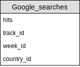

# Entity-Relationship diagrams

Since we plan on using Mondarian with a classical relational database as the backend of our project we have converted our multidimentional schema into a star of tables.

###Chart Entry

###Song Features

###Google Searches

