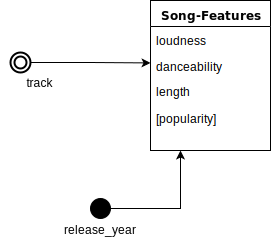

#Facts

We describe our database with thoses facts schemas :

###Chart Entry 

This schema represent the popularity of a song on spotify with the rank by the number of streams.

###Song Features 

This fact represent song informations like the song length or the  loudness by genre, years and the song title.

###Google Searches

 This fact represent the number searches on Google with a keyword like the artist name or an album.