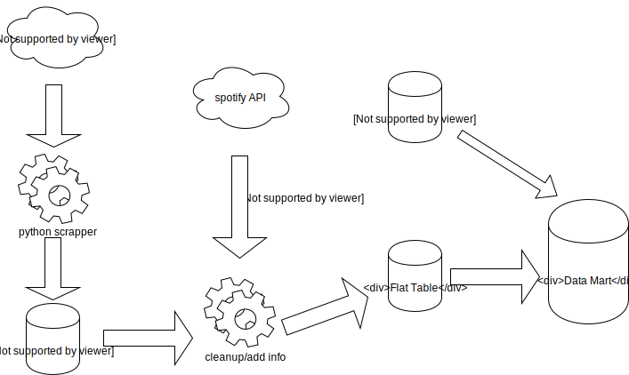
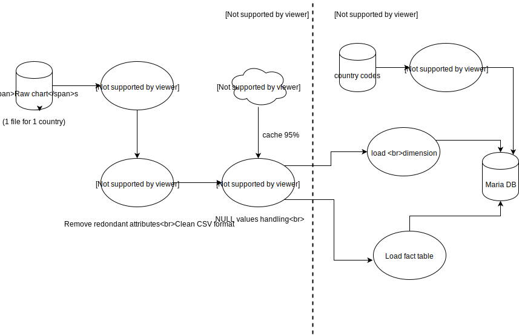
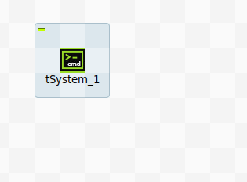
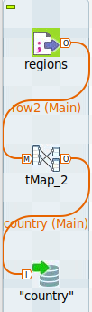

<h1 style="text-align:center"> BI Project</h1>

<h2 style="text-align:center!important;">
Loading Phase
</h2>

### Tong Xinze - Ringuet Nicolas - Chanson Alexandre

## Introduction

In this phase we loaded the data into the previously created warehouse, this represents the bulk of the work of the data warehousing project.

 We opted for a mixed approach using both ETL software (talend) and custom scripts written in python to improve performances. As we query an API for information we built a simple caching engine in python to avoid hitting the rate limits.

## Architecture

We chose to shift our initial plan to use the million song dataset to using the spotify API, this approach enables us to obtain up to date information and to avoid matching ID between too systems. The informations we wanted on google searches of songs turned out to be quite expensive so we didn't include it in the warehouse (This would have been solved by asking money to our boss in a profesionnal environement).

We plan to add data from twitter and other social media platforms to have additional features for the data mining process.

## Master Job

The master job is split accross the two technologies, python first and talend next handling the last phase. In simpler terms the E and T phases are done using python while talend handles the L phase.

The scripts are available on [github](https://github.com/alexchanson/DW/scripts) and a description of the talend jobs thereafter.

### Python excecutor

This is a simple job that runs all the python scripts necessary to exctract and clean the data. The scripts are in order:

#### charts.py

scraps data for one country and on week from charts.spotify.com

#### mergecsv.py

merges files from all countries

#### addattributes.py

queries the spotify api for additional data (track\_popularity, followers, artist\_ popularity, artist\_genre, album\_ name, artist\_id, release\_year, tempo, danceability, length) using cache to avoid making too much requests.

#### builddb.py

### Exctract & Load Country Codes

The country codes come from [github](https://github.com/lukes/ISO-3166-Countries-with-Regional-Codes) and doesnt need much processing, its IDs are simply turned to lowercase and loaded in the database.

### Load flat table

This job takes on after the python API requester has done it's job, it firsts checks lines for null values (mostly deleted songs from spotify that have id but with all other information absent). It then sends off the clean lines to mappers that handle schema mapping between the flat table and the database.

## Star schema

The principal fact is translated to a start schema, the one to many relationship is handled using a bridge (Table Plays), this is the abstract table schema (primary keys underlined) types are specifed in the SQL table creation script.

[Create table SQL](../scripts/create_tables.sql)

The second fact that stores metrics about songs shares it's dimension with the main fact, here track_id is the fact table's primary key and a foreign key linking to Track.

## Conclusion

The loading was a complex operation yet It would have been simpler to use only python as talend only performs Loading operation and most of the logic for API querring cannot be easly integrated in this tool. We learn that not all data is free and next time we want a specific data set such as google searches we will first check if we can obtain it and at what price point.

## Anexe 1: Refreshment

As the database was created manually (using Datagrip) it is not necessary to use a separate talend job we simply run the same job with different parameters (only one week span). The country code loading is not excecuted. 
