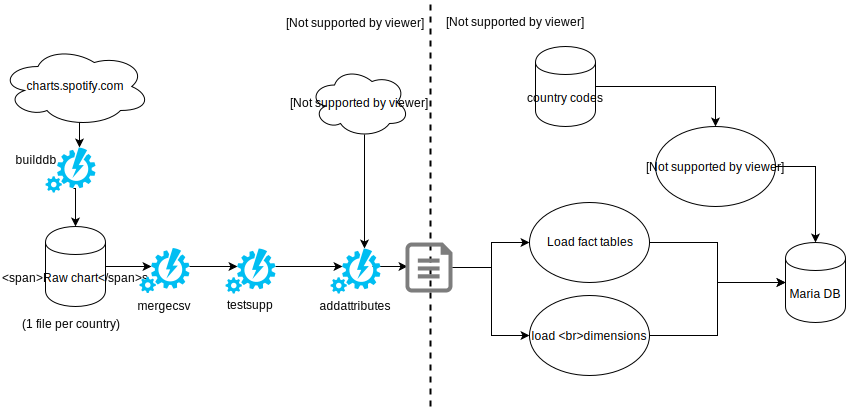

<h1 style="text-align:center"> BI Project</h1>

<h2 style="text-align:center!important;">
Loading Phase
</h2>

### Tong Xinze - Ringuet Nicolas - Chanson Alexandre

## Introduction

In this phase we loaded the data into the previously created warehouse, this represents the bulk of the work of the data warehousing project.

 We opted for a mixed approach using both ETL software (talend) and custom scripts written in python to improve performances. As we query an API for information we built a simple caching engine in python to avoid hitting the rate limits.

## Architecture


We chose to shift our initial plan to use the million song dataset to using the spotify API, this approach enables us to obtain up to date information and to avoid matching ID between too systems. The informations we wanted on google searches of songs turned out to be quite expensive so we didn't include it in the warehouse (This would have been solved by asking money to our boss in a profesionnal environement).

We plan to add data from twitter and other social media platforms to have additional features for the data mining process.

## Master Job



The master job is split accross the two technologies, python first and talend next handling the last phase. In simpler terms the E and T phases are done using python while talend handles the L phase.

Note on the NULL value:

The null values are on artist,song and album names, bu the id are still present.  When the id is used to access the spotify.com website we obtain 404 errors or empty pages, the api also flags most of those id as invalid. We presume this is from deleted content as it was probably valid when the charts were created but removed since. Those values are therefore not left as NULL be named DELETED.

This is trivial as all lines with deleted information follow the same pattern, a simple linux command is used:

```bash
cat out_?? | sed 's/;;;/;DELETED;DELETED;/' | sed 's/;;/;DELETED;/' > nonull.csv
```

(sed shows ludicrous performances compared to talend, it can parse more than a million lines per second)

The scripts are available on [github](https://github.com/alexchanson/DW/scripts) and a description of the talend jobs thereafter.

## Star schema


The principal fact is translated to a start schema, the one to many relationship is handled using a bridge (Table Plays), this is the abstract table schema (primary keys underlined) types are specifed in the SQL table creation script.

[Create table SQL](../scripts/create_tables.sql)


The second fact that stores metrics about songs shares it's dimension with the main fact, here track_id is the fact table's primary key and a foreign key linking to Track.

##Conclusion

The loading was a complex operation yet It would have been simpler to use only python as talend only performs Loading operation and most of the logic for API querring cannot be easly integrated in this tool. We learn that not all data is free and next time we want a specific data set such as google searches we will first check if we can obtain it and at what price point.


