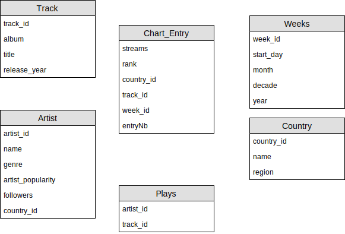

<h1 style="text-align:center"> BI Project</h1>

<h2 style="text-align:center!important;">
Loading Phase
</h2>

### Tong Xinze - Ringuet Nicolas - Chanson Alexandre

## Introduction

## Architecture overview

explain choices in archietecture here

## Master Job

## Star schema

The principal fact is translated to a start schema, the one to many relationship is handled using a bridge (Table Plays), this is the abstract table schema (primary keys underlined) types are specifed in the SQL table creation script.

[Create table SQL](../scripts/create_tables.sql)

The second fact that stores metrics about songs shares it's dimension with the main fact, here track_id is the fact table's primary key and a foreign key linking to Track.
